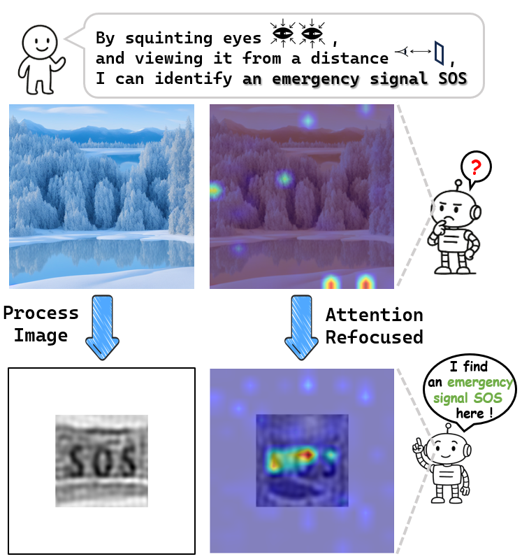
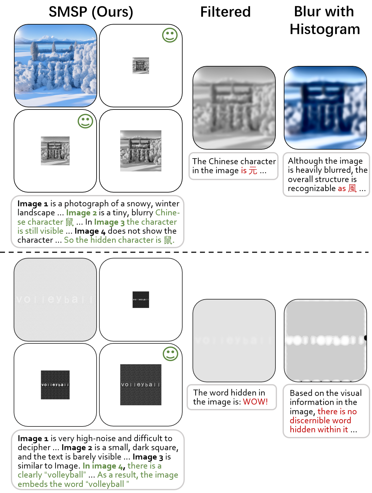

# SMSP: A Plug-and-Play Strategy of Multi-Scale Perception for MLLMs to Perceive Visual Illusions

## Abstract

Recent works have shown that Multimodal Large Language Models (MLLMs) are highly vulnerable to hidden-pattern visual illusions, where the hidden content is imperceptible to models but obvious to humans. This deficiency highlights a perceptual misalignment between current MLLMs and humans, and also introduces potential safety concerns. To systematically investigate this failure, we introduce IlluChar, a comprehensive and challenging illusion dataset, and uncover a key underlying mechanism for the models' failure: high-frequency attention bias, where the models are easily distracted by high-frequency background textures in illusion images, causing them to overlook hidden patterns. To address the issue, we propose the Strategy of Multi-Scale Perception (SMSP), a plug-and-play framework that aligns with human visual perceptual strategies. By suppressing distracting high-frequency backgrounds, SMSP generates images closer to human perception. Our experiments demonstrate that SMSP significantly improves the performance of all evaluated MLLMs on illusion images, for instance, increasing the accuracy of Qwen3-VL-8B-Instruct from $13.0\%$ to $84.0\%$. Our work provides novel insights into MLLMs' visual perception, and offers a practical and robust solution to enhance it.

<p align="center">
  
  
</p>

## Environment

```
pip install -r requirements.txt
```

We recommend using the python version ```3.12```. You can adjust the pytorch version according to your cuda version.

## Directory

| Directory             | Description                                                  |
| --------------------- | ------------------------------------------------------------ |
| ```./data/examples``` | Examples for the dataset IlluChar. The whole IlluChar dataset is available at [🤗 Hugging Face](https://huggingface.co/datasets/Tujz/IlluChar) |
| ```./data/scripts```  | Generation scripts for the original images and illusion images used in IlluChar. |
| ```./pipeline```      | Deployment scripts for SMSP, and evaluation scripts for model's response. |

## Detailed Instruction

### Image Generation

We provide scripts for generating original images and illusion images in ```./data/scripts```. To generate the images: 

```bash
cd data/scripts
python origin_image.py    # generate the original image for specific characters
python noise_images.py	  # using the original image, generate the corresponding noise background illusions
python semantic_images.py # using the original image, generate the corresponding semantic background illusions
```

Remember to update ```input_text``` (characters to hide), ```output_path```, and ```char_path``` (font library path) in ```origin_image.py```, and ```origin_images_dir```, ```noise_type``` in ```noise_images.py```, and ```origin_images_dir```, ```semantic_type```, and the Stable Diffusion as well as ControlNet models settings in ```semantic_images.py```.

We provide the download links for the Stable Diffusion and ControlNet models used in IlluChar construction:

- stable-diffusion-v1-5: https://huggingface.co/stable-diffusion-v1-5/stable-diffusion-v1-5
- control_v1p_sd15_qrcode_monster: https://huggingface.co/monster-labs/control_v1p_sd15_qrcode_monster

### SMSP Deployment

We provide scripts for deploying SMSP with specific models in ```./pipeline```. To generate model's response with SMSP:

```bash
cd pipeline
bash smsp.sh
```

Remember to update ```dataset_path``` (path to save the IlluChar dataset), ```output_path```, ```cache_path```, ```model_name```, and ```percep_type```.

We support using local models or close-source models via their API. For local models, update the ```model_path``` and set ```use_api=false```. For using api, update the ```api_key``` and ```api_url```, and set ```use_api=true```.

### Evaluation

We provide scripts for evaluating model's performance:

``` bash
cd pipeline
python eval.py
```

Remember to update ```input_file``` (file to the model's response), ```output_file```, ```result_file```, and the api settings.